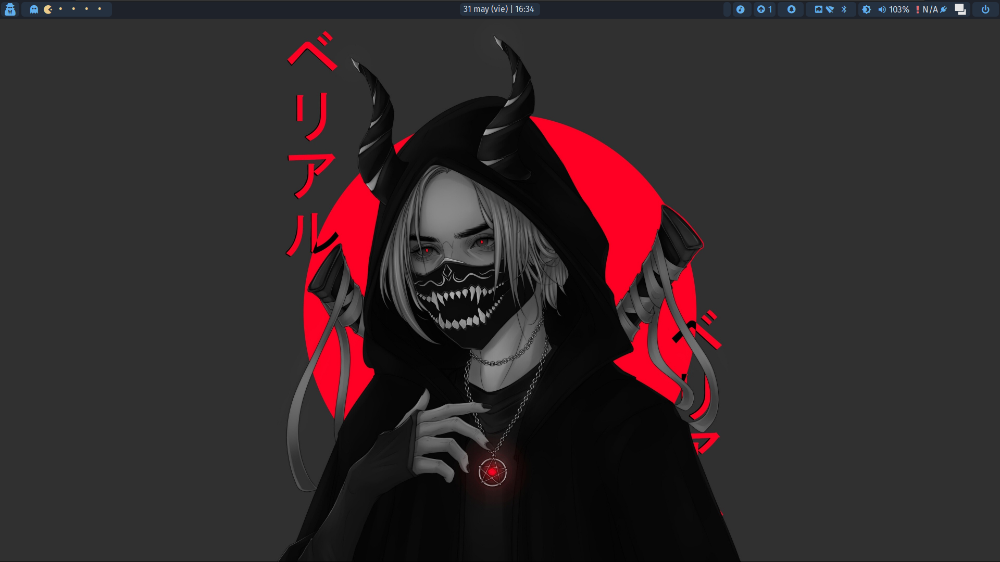
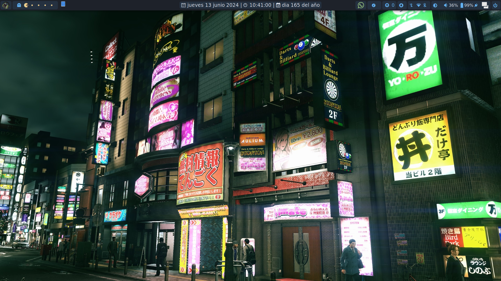
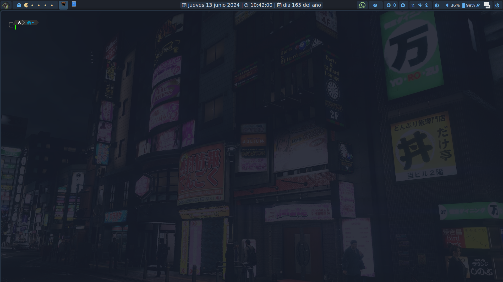
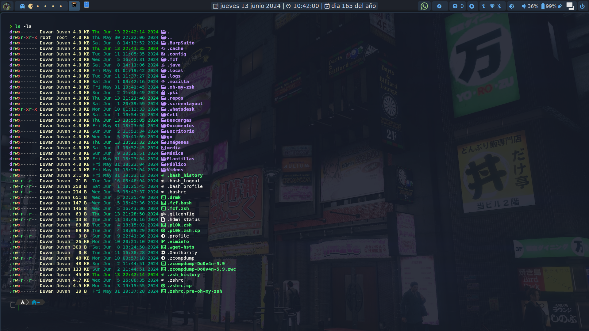
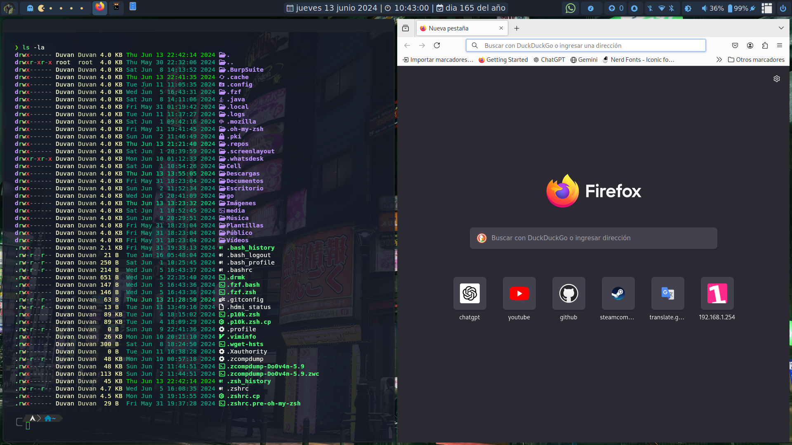

## Awesome
<div align="center">
    
</div>

<br>

<p align="center">
	
</p>

### ¡Bienvenido y gracias por pasarte!
Estas son mis configuraciones personales de AwesomeWM.

Utilizo el esquema de colores OneDark para todo.

Cuando se trata de funcionalidad y personalización, lo increíble se acerca mucho al entorno de escritorio completo.
Awesome puede hacer todo lo que necesito desde el escritorio con dependencias y recursos del sistema mínimos.

Además del increíble administrador de ventanas, uso los siguientes programas.

|            | Programs           |
| ---------- | ------------------ |
| Terminal   | kitty              |
| Shell      | zsh                |
| Editor     | neovim             |

<br>

## Collage de Imágenes
<div align="center">
    
    
    
    
</div>

<br>

## Configuración

- Instalar dependencias
  ```sh
  yay -Sy awesome-git pamixer mpc mpd ncmpcpp playerctl xorg-xbacklight rofi jq maim simple-mtpfs ffmpeg fuse2 wmctrl xclip \ xdotool --needed
  ```
- Clonar este repositorio

   Move your old configurations to separate location and copy configs to your ~/.config

    ```sh
   git clone  https://github.com/Duvan-H16/Awesome.git
   cd Awesome/
   [ -d "$HOME/.config/awesome" ] && mv $HOME/.config/awesome $HOME/.config/Bkpawesome
   [ -d "$HOME/.config/ncmpcpp" ] && mv $HOME/.config/ncmpcpp $HOME/.config/Bkpncmpcpp
   cd Config/
   cp -r awesome $HOME/.config/
   cp -r ncmpcpp $HOME/.config/
  ```
- Copiar configuracion de rofi
  ```sh
  $ mkdir -pv ~/.config/rofibkp
  $ mv ~/.config/rofi ~/.config/rofibkp
  ```
  Instale las fuentes (elija cualquiera que desee) Nota: Hay 2-3 versiones de fuentes de diseño de materiales. Solo asegúrese de tener solo el que he puesto en la carpeta de fuentes.

- Del sistema
  ```sh
  $ sudo cp -r ./fonts /usr/share/fonts/
  $ fc-cache -fv
  ```
- Solo del usuario
  ```sh
  $ [ -d "$HOME/.local/share/fonts" ] || mkdir -pv $HOME/.local/share/fonts
  $ cp -r ./fonts $HOME/.local/share/fonts
  $ fc-cache -fv
  ```
- Copiar scripts y configuraciones de ROFI
  ```sh
  $ [ -d "$HOME/.config/rofi" ] || mkdir -pv $HOME/.config/rofi
  $ cp -r ./rofi $HOME/.config
  ```
- Instale todas las fuentes de la carpeta de fuentes
    ```sh
    cd ..
    cp -r fonts $HOME/.local/share/fonts
    fc-cache -fv
    ```
- Por último

Consulte el archivo rc.lua, contiene documentación de Awesome mis archivos de configuración. Y vaya a la carpeta de configuración dentro de Awesome y seleccione los programas específicos de su sistema.

 Agregué el archivo XResources si desea cambiar los colores terminales para que coincidan con el resto de la configuración, puede usarlo (opcional)


## Créditos para
  [elenapan's dotfiles for some part of configurations](https://github.com/elenapan/dotfiles)
